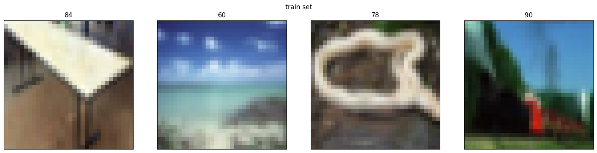
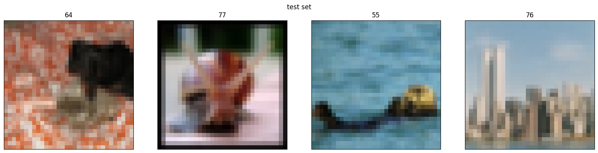
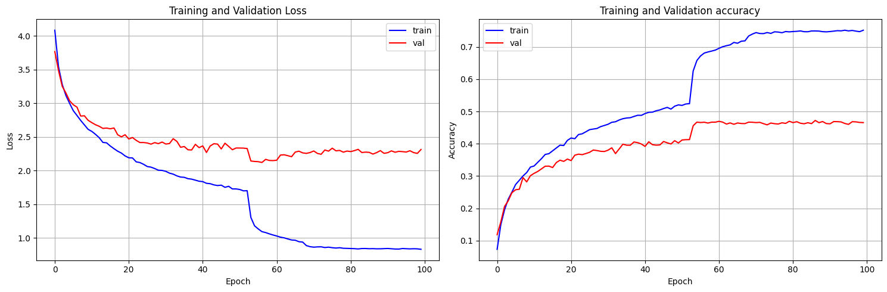
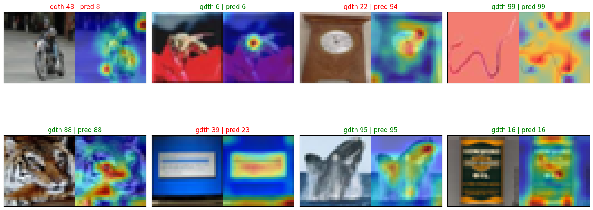

# ViT Paper Code Walk Through

Please refer to the main.ipynb for code. Original author: https://github.com/tintn/vision-transformer-from-scratch/tree/main

# 1. Prepare the CIFAR10/100 dataset




# 2. Prepare the model and train

1. Embeddings model for dividing image into patches and perform encoding using `nn.Conv2d`.
2. Embedded tokens of an image is applied transformer attention computation
3. Encoded `cls_token` is used to output class scores

```txt
[2025-02-16 17:32:59|INFO] [epoch   1] train loss: 4.09, train accu: 0.07, val loss: 3.77, val accu: 0.12
[2025-02-16 17:33:06|INFO] [epoch   2] train loss: 3.54, train accu: 0.15, val loss: 3.49, val accu: 0.16
[2025-02-16 17:33:13|INFO] [epoch   3] train loss: 3.28, train accu: 0.20, val loss: 3.25, val accu: 0.21
[2025-02-16 17:33:20|INFO] [epoch   4] train loss: 3.12, train accu: 0.23, val loss: 3.15, val accu: 0.22
[2025-02-16 17:33:26|INFO] [epoch   5] train loss: 3.00, train accu: 0.25, val loss: 3.04, val accu: 0.25
[2025-02-16 17:33:33|INFO] [epoch   6] train loss: 2.89, train accu: 0.27, val loss: 2.98, val accu: 0.26
[2025-02-16 17:33:40|INFO] [epoch   7] train loss: 2.82, train accu: 0.29, val loss: 2.94, val accu: 0.26
[2025-02-16 17:33:46|INFO] [epoch   8] train loss: 2.74, train accu: 0.30, val loss: 2.81, val accu: 0.30
[2025-02-16 17:33:53|INFO] [epoch   9] train loss: 2.68, train accu: 0.31, val loss: 2.81, val accu: 0.28
[2025-02-16 17:34:00|INFO] [epoch  10] train loss: 2.61, train accu: 0.33, val loss: 2.75, val accu: 0.30
[2025-02-16 17:34:06|INFO] [epoch  11] train loss: 2.58, train accu: 0.33, val loss: 2.71, val accu: 0.31
[2025-02-16 17:34:13|INFO] [epoch  12] train loss: 2.54, train accu: 0.34, val loss: 2.68, val accu: 0.31
[2025-02-16 17:34:20|INFO] [epoch  13] train loss: 2.49, train accu: 0.35, val loss: 2.66, val accu: 0.32
[2025-02-16 17:34:26|INFO] [epoch  14] train loss: 2.42, train accu: 0.37, val loss: 2.63, val accu: 0.33
[2025-02-16 17:34:33|INFO] [epoch  15] train loss: 2.41, train accu: 0.37, val loss: 2.63, val accu: 0.33
[2025-02-16 17:34:40|INFO] [epoch  16] train loss: 2.36, train accu: 0.38, val loss: 2.62, val accu: 0.33
[2025-02-16 17:34:47|INFO] [epoch  17] train loss: 2.33, train accu: 0.39, val loss: 2.63, val accu: 0.34
[2025-02-16 17:34:53|INFO] [epoch  18] train loss: 2.29, train accu: 0.40, val loss: 2.53, val accu: 0.35
[2025-02-16 17:35:00|INFO] [epoch  19] train loss: 2.26, train accu: 0.39, val loss: 2.50, val accu: 0.35
[2025-02-16 17:35:07|INFO] [epoch  20] train loss: 2.22, train accu: 0.41, val loss: 2.53, val accu: 0.35
[2025-02-16 17:35:13|INFO] [epoch  21] train loss: 2.19, train accu: 0.42, val loss: 2.47, val accu: 0.35
[2025-02-16 17:35:20|INFO] [epoch  22] train loss: 2.19, train accu: 0.42, val loss: 2.49, val accu: 0.36
[2025-02-16 17:35:27|INFO] [epoch  23] train loss: 2.13, train accu: 0.43, val loss: 2.45, val accu: 0.37
[2025-02-16 17:35:34|INFO] [epoch  24] train loss: 2.12, train accu: 0.43, val loss: 2.42, val accu: 0.37
[2025-02-16 17:35:40|INFO] [epoch  25] train loss: 2.09, train accu: 0.44, val loss: 2.42, val accu: 0.37
...
```



# 3. Visualize attention

Check attentions that `cls_token` grasp from other patch token.


